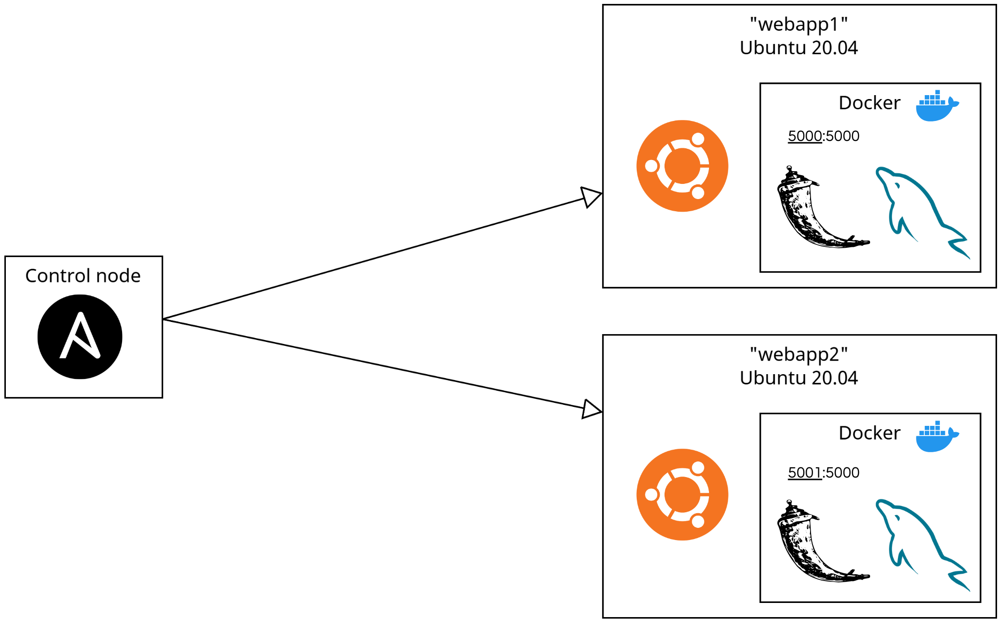

# ansible-webapp-deployment

## Overview

Deploy, on multiple hosts, a simple web application (Flask + MySQL database) using Ansible playbook and roles.

## Architecture

    

## Deployment preparation

## Usage
