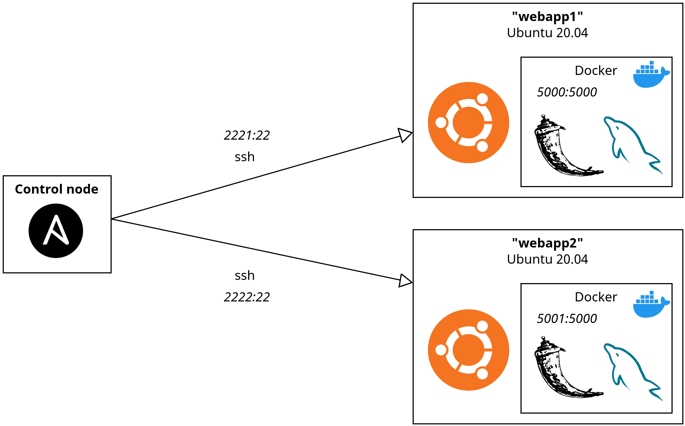

# ansible-webapp-deployment

## Overview

Deploy, on multiple hosts, a simple web application (Flask + MySQL database) using Ansible playbook and roles.

## Architecture

<div align="center">
    
</div>

## Prerequisites

The following packages are required:

- [`ansible`](https://docs.ansible.com/ansible/latest/installation_guide/index.html)
- [`docker`](https://docs.docker.com/engine/install/)
- `sshpass`

## Deployment preparation

Copy and customize the environment variables using the example file:

```bash
cp .env.example .env
```

Build the Docker image:

```bash
docker build -t webapp .
```

Run the containers:

```bash
docker run -d --name webapp1 --env-file .env -p 2221:22 -p 5000:5000 webapp
docker run -d --name webapp2 --env-file .env -p 2222:22 -p 5001:5000 webapp
```

## Usage

> **⚠️ Warning**  
> Some sensitive variables used in this project are encrypted using Ansible Vault in `vault.yml` files:  
> - [`group_vars/webapp/vault.yml`](https://github.com/avirgos/ansible-webapp-deployment/blob/master/group_vars/webapp/vault.yml)  
> - [`roles/mysql-db/vars/vault.yml`](https://github.com/avirgos/ansible-webapp-deployment/blob/master/roles/mysql-db/vars/vault.yml)  
>  
> To modify these sensitive variables, use the `ansible-vault` command to edit or re-encrypt the files, ensuring to use the correct vault password:
> ```bash
> ansible-vault edit group_vars/webapp/vault.yml --vault-password-file .vault_pass.txt
> ansible-vault edit roles/mysql-db/vars/vault.yml --vault-password-file .vault_pass.txt
> ```

Execute the playbook with the following command:

```bash
ansible-playbook deploy-webapp.yml
```