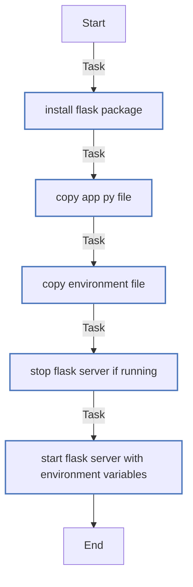

<!-- DOCSIBLE START -->

# 📃 Role overview

## flask_web

Description: Deploy Flask web server

| Field                | Value           |
|--------------------- |-----------------|
| `README.md` update        | 22/09/2025 |

### Tasks

#### File: `tasks/main.yml`

| Name | Module | Has Conditions |
| ---- | ------ | -------------- |
| Install Flask package | `ansible.builtin.pip` | False |
| Copy app.py file | `ansible.builtin.copy` | False |
| Copy environment file | `ansible.builtin.copy` | False |
| Stop Flask server if running | `ansible.builtin.command` | False |
| Start Flask server with environment variables | `ansible.builtin.shell` | False |

## Task Flow Graph

### Graph for `main.yml`

## Author Information

Antoine Virgos (@avirgos)

#### License

MIT

#### Minimum Ansible Version

2.1

#### Platforms

No platforms specified.

#### Dependencies

No dependencies specified.
<!-- DOCSIBLE END -->
