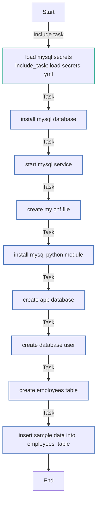
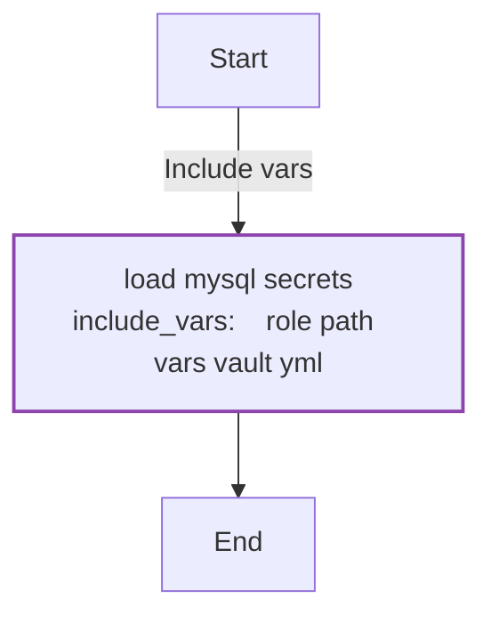

<!-- DOCSIBLE START -->

# 📃 Role overview

## mysql_db


Description: Deploy a MySQL database


| Field                | Value           |
|--------------------- |-----------------|
| Readme update        | 22/09/2025 |


### Defaults

**These are static variables with lower priority**

#### File: defaults/main.yml

| Var          | Type         | Value       |
|--------------|--------------|-------------|
| [mysql_db_db_name](defaults/main.yml#L2)   | str | `employee_db` |    
| [mysql_db_db_user](defaults/main.yml#L3)   | str | `db_user` |    


### Vars

**These are variables with higher priority**
#### File: vars/vault.yml

| Var          | Type         | Value       |
|--------------|--------------|-------------|
| [mysql_db_root_password](vars/vault.yml#L2)   | str | `ENCRYPTED_WITH_ANSIBLE_VAULT` |    


### Tasks


#### File: tasks/load-secrets.yml

| Name | Module | Has Conditions |
| ---- | ------ | -------------- |
| Load MySQL secrets | ansible.builtin.include_vars | False |

#### File: tasks/main.yml

| Name | Module | Has Conditions |
| ---- | ------ | -------------- |
| Load MySQL secrets | ansible.builtin.include_tasks | False |
| Install MySQL database | ansible.builtin.apt | False |
| Start MySQL service | ansible.builtin.command | False |
| Create `.my.cnf` file | ansible.builtin.copy | False |
| Install MySQL python module | ansible.builtin.pip | False |
| Create app database | community.mysql.mysql_db | False |
| Create database user | community.mysql.mysql_user | False |
| Create `employees` table | community.mysql.mysql_query | False |
| Insert sample data into `employees` table | community.mysql.mysql_query | False |


## Task Flow Graphs


### Graph for main.yml




### Graph for load-secrets.yml




## Playbook

```yml
---
- name: Load MySQL secrets
  ansible.builtin.include_tasks: load-secrets.yml

- name: Install MySQL database
  ansible.builtin.apt:
    name: "{{ item }}"
    state: present
  with_items:
    - mysql-server
    - mysql-client

- name: Start MySQL service
  ansible.builtin.command: /etc/init.d/mysql start
  changed_when: false

- name: Create `.my.cnf` file
  ansible.builtin.copy:
    dest: "/root/.my.cnf"
    content: |
      [client]
      user=root
      password={{ mysql_db_root_password }}
      host=localhost
      socket=/var/run/mysqld/mysqld.sock
    owner: root
    group: root
    mode: '0600'

- name: Install MySQL python module
  ansible.builtin.pip:
    name: pymysql
    state: present

- name: Create app database
  community.mysql.mysql_db:
    name: "{{ mysql_db_db_name }}"
    state: present

- name: Create database user
  community.mysql.mysql_user:
    name: "{{ mysql_db_db_user }}"
    password: "{{ mysql_db_root_password }}"
    priv: '*.*:ALL'
    state: present
    host: '%'

- name: Create `employees` table
  community.mysql.mysql_query:
    query: |
      CREATE TABLE IF NOT EXISTS employee_db.employees (
        id INT PRIMARY KEY AUTO_INCREMENT,
        name VARCHAR(100)
      );

- name: Insert sample data into `employees` table
  community.mysql.mysql_query:
    query: |
      INSERT INTO employee_db.employees (name) VALUES ('John'), ('Antoine');

```
## Playbook graph
```mermaid
flowchart TD
```

## Author Information
Antoine Virgos (@avirgos)

#### License

MIT

#### Minimum Ansible Version

2.1

#### Platforms

No platforms specified.

#### Dependencies

No dependencies specified.
<!-- DOCSIBLE END -->
