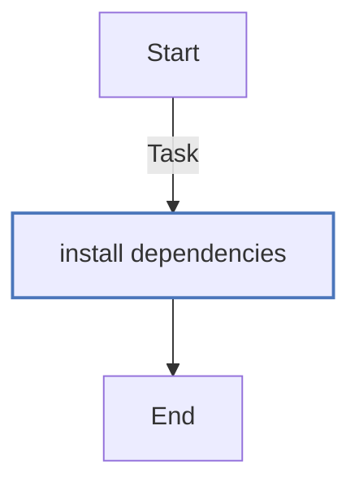

<!-- DOCSIBLE START -->

# 📃 Role overview

## python

Description: Install Python dependencies for Flask web application

| Field                | Value           |
|--------------------- |-----------------|
| `README.md` update        | 22/09/2025 |

### Tasks

#### File: `tasks/main.yml`

| Name | Module | Has Conditions |
| ---- | ------ | -------------- |
| Install dependencies | ansible.builtin.apt | False |

## Task Flow Graph

### Graph for `main.yml`

## Author Information

Antoine Virgos (@avirgos)

#### License

MIT

#### Minimum Ansible Version

2.1

#### Platforms

No platforms specified.

#### Dependencies

No dependencies specified.
<!-- DOCSIBLE END -->
